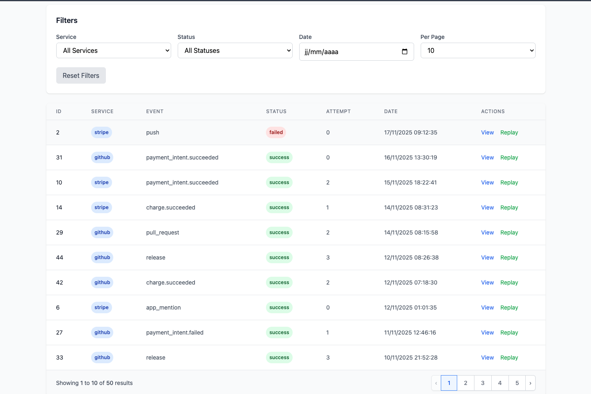
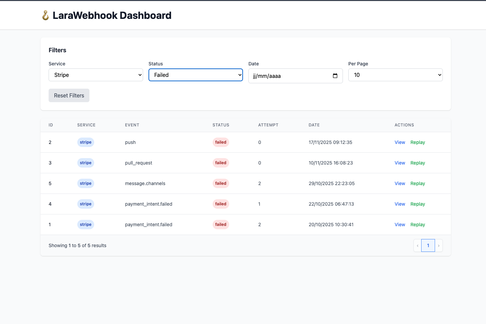
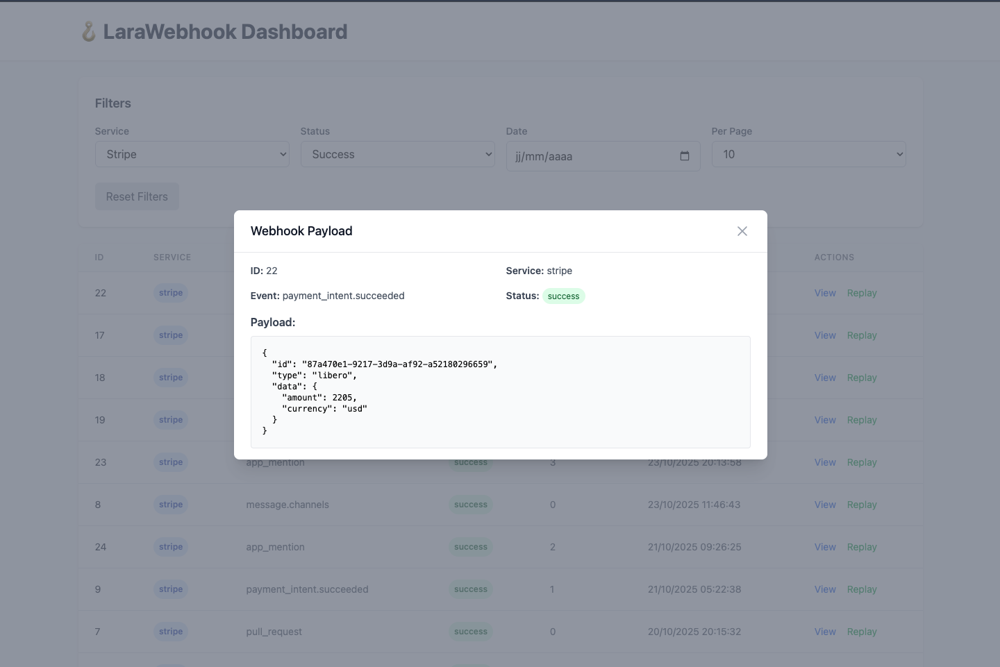

# LaraWebhook 🚀

[](https://packagist.org/packages/proxynth/larawebhook)
[](https://github.com/proxynth/larawebhook/actions)
[](https://codecov.io/github/proxynth/LaraWebhook)
[](https://github.com/proxynth/larawebhook/actions)
[](LICENSE)

**LaraWebhook** is an open-source Laravel package for handling incoming webhooks in a **secure, reliable, and simple** way. Validate signatures, manage retries, log events, and integrate popular services (Stripe, GitHub, Slack, etc.) in minutes.

---

## ✨ Features

- **Signature Validation**: Verify webhook authenticity (Stripe, GitHub, etc.)
- **Retry Management**: Automatically retry failed webhooks with exponential backoff
- **Detailed Logging**: Store events and errors for debugging
- **Interactive Dashboard**: Modern UI with Alpine.js and Tailwind CSS for log management
- **REST API**: Programmatic access to webhook logs with filtering and pagination
- **Replay Webhooks**: Re-process failed webhooks from dashboard or API
- **Easy Integration**: Minimal configuration, compatible with Laravel 9+
- **Extensible**: Add your own validators or services

---

## 📦 Installation

1. Install the package via Composer:
   ```bash
   composer require proxynth/larawebhook
   ```

2. Publish the configuration:
   ```bash
   php artisan vendor:publish --provider="Proxynth\LaraWebhook\LaraWebhookServiceProvider"
   ```

3. Configure your signature keys in `config/larawebhook.php`:
   ```php
   'stripe' => [
        'webhook_secret' => env('STRIPE_WEBHOOK_SECRET'),
        'tolerance' => 300, // Tolerance in seconds
   ],
   ```

---

## 🛠 Usage

### Using the Middleware (Recommended)

The easiest way to validate webhooks is using the `validate-webhook` middleware:

```php
// routes/web.php
Route::post('/stripe-webhook', function () {
    // Webhook is automatically validated and logged
    // Process your webhook here
    $payload = json_decode(request()->getContent(), true);

    // Handle the event
    event(new \App\Events\StripeWebhookReceived($payload));

    return response()->json(['status' => 'success']);
})->middleware('validate-webhook:stripe');

Route::post('/github-webhook', function () {
    // Webhook is automatically validated and logged
    $payload = json_decode(request()->getContent(), true);

    // Handle the event
    event(new \App\Events\GithubWebhookReceived($payload));

    return response()->json(['status' => 'success']);
})->middleware('validate-webhook:github');
```

**What the middleware does:**
- ✅ Validates the webhook signature
- ✅ Automatically logs the event to the database
- ✅ Returns 403 for invalid signatures
- ✅ Returns 400 for missing headers or malformed payloads

### Manual Validation (Advanced)

For more control, you can manually validate webhooks:

```php
// app/Http/Controllers/WebhookController.php
use Proxynth\Larawebhook\Services\WebhookValidator;
use Illuminate\Http\Request;

public function handleWebhook(Request $request)
{
    $payload = $request->getContent();
    $signature = $request->header('Stripe-Signature');
    $secret = config('larawebhook.services.stripe.webhook_secret');

    $validator = new WebhookValidator($secret);

    try {
        // Validate and log in one call
        $log = $validator->validateAndLog(
            $payload,
            $signature,
            'stripe',
            'payment_intent.succeeded'
        );

        // Process the event
        event(new \App\Events\StripeWebhookReceived(json_decode($payload, true)));

        return response()->json(['status' => 'success']);
    } catch (\Exception $e) {
        return response($e->getMessage(), 403);
    }
}
```

---

## 🔌 Service Integration Examples

Complete integration guides with real-world examples for popular webhook providers.

### 🔵 Stripe Integration

#### 1. Configuration

Add your Stripe webhook secret to `.env`:

```env
STRIPE_WEBHOOK_SECRET=whsec_your_stripe_webhook_secret_here
```

Then configure the service in `config/larawebhook.php`:

```php
'services' => [
    'stripe' => [
        'webhook_secret' => env('STRIPE_WEBHOOK_SECRET'),
        'tolerance' => 300, // 5 minutes tolerance for timestamp validation
    ],
],
```

#### 2. Create Route and Controller

**Define the webhook route** in `routes/web.php`:

```php
use App\Http\Controllers\StripeWebhookController;

Route::post('/stripe-webhook', [StripeWebhookController::class, 'handle'])
    ->middleware('validate-webhook:stripe');
```

**Create the controller** at `app/Http/Controllers/StripeWebhookController.php`:

```php
<?php

namespace App\Http\Controllers;

use Illuminate\Http\Request;
use Illuminate\Http\JsonResponse;
use Illuminate\Support\Facades\Log;

class StripeWebhookController extends Controller
{
    public function handle(Request $request): JsonResponse
    {
        // Webhook is already validated by the middleware
        $payload = json_decode($request->getContent(), true);
        $event = $payload['type'] ?? 'unknown';

        // Route to specific event handlers
        match ($event) {
            'payment_intent.succeeded' => $this->handlePaymentIntentSucceeded($payload),
            'payment_intent.payment_failed' => $this->handlePaymentIntentFailed($payload),
            'charge.succeeded' => $this->handleChargeSucceeded($payload),
            'charge.failed' => $this->handleChargeFailed($payload),
            'customer.subscription.created' => $this->handleSubscriptionCreated($payload),
            'customer.subscription.updated' => $this->handleSubscriptionUpdated($payload),
            'customer.subscription.deleted' => $this->handleSubscriptionDeleted($payload),
            'invoice.paid' => $this->handleInvoicePaid($payload),
            'invoice.payment_failed' => $this->handleInvoicePaymentFailed($payload),
            default => $this->handleUnknownEvent($event, $payload),
        };

        return response()->json(['status' => 'success']);
    }

    private function handlePaymentIntentSucceeded(array $payload): void
    {
        $paymentIntent = $payload['data']['object'];

        Log::info('Stripe: Payment intent succeeded', [
            'payment_intent_id' => $paymentIntent['id'],
            'amount' => $paymentIntent['amount'],
            'currency' => $paymentIntent['currency'],
            'customer' => $paymentIntent['customer'],
        ]);

        // Example: Update order status in your database
        // Order::where('stripe_payment_intent_id', $paymentIntent['id'])
        //     ->update(['status' => 'paid']);
    }

    private function handlePaymentIntentFailed(array $payload): void
    {
        $paymentIntent = $payload['data']['object'];

        Log::error('Stripe: Payment intent failed', [
            'payment_intent_id' => $paymentIntent['id'],
            'last_payment_error' => $paymentIntent['last_payment_error'],
        ]);

        // Example: Notify customer of payment failure
        // $order = Order::where('stripe_payment_intent_id', $paymentIntent['id'])->first();
        // Mail::to($order->customer->email)->send(new PaymentFailedMail($order));
    }

    private function handleChargeSucceeded(array $payload): void
    {
        $charge = $payload['data']['object'];

        Log::info('Stripe: Charge succeeded', [
            'charge_id' => $charge['id'],
            'amount' => $charge['amount'],
        ]);
    }

    private function handleChargeFailed(array $payload): void
    {
        $charge = $payload['data']['object'];

        Log::error('Stripe: Charge failed', [
            'charge_id' => $charge['id'],
            'failure_message' => $charge['failure_message'],
        ]);
    }

    private function handleSubscriptionCreated(array $payload): void
    {
        $subscription = $payload['data']['object'];

        Log::info('Stripe: Subscription created', [
            'subscription_id' => $subscription['id'],
            'customer' => $subscription['customer'],
            'status' => $subscription['status'],
        ]);

        // Example: Grant access to premium features
        // User::where('stripe_customer_id', $subscription['customer'])
        //     ->update(['subscription_status' => 'active']);
    }

    private function handleSubscriptionUpdated(array $payload): void
    {
        $subscription = $payload['data']['object'];

        Log::info('Stripe: Subscription updated', [
            'subscription_id' => $subscription['id'],
            'status' => $subscription['status'],
        ]);
    }

    private function handleSubscriptionDeleted(array $payload): void
    {
        $subscription = $payload['data']['object'];

        Log::info('Stripe: Subscription deleted', [
            'subscription_id' => $subscription['id'],
        ]);

        // Example: Revoke access to premium features
        // User::where('stripe_customer_id', $subscription['customer'])
        //     ->update(['subscription_status' => 'cancelled']);
    }

    private function handleInvoicePaid(array $payload): void
    {
        $invoice = $payload['data']['object'];

        Log::info('Stripe: Invoice paid', [
            'invoice_id' => $invoice['id'],
            'amount_paid' => $invoice['amount_paid'],
        ]);
    }

    private function handleInvoicePaymentFailed(array $payload): void
    {
        $invoice = $payload['data']['object'];

        Log::error('Stripe: Invoice payment failed', [
            'invoice_id' => $invoice['id'],
            'attempt_count' => $invoice['attempt_count'],
        ]);
    }

    private function handleUnknownEvent(string $event, array $payload): void
    {
        Log::warning('Stripe: Unknown event type received', [
            'event_type' => $event,
        ]);
    }
}
```

#### 3. Webhook Flow Diagram

```
┌─────────────────┐         ┌──────────────────────┐         ┌─────────────────────┐
│                 │         │                      │         │                     │
│  Stripe Server  │────────▶│  LaraWebhook         │────────▶│  Your Application   │
│                 │  POST   │  - Validates         │  Valid  │  - Process event    │
│  (Webhook)      │         │    signature         │         │  - Update database  │
│                 │         │  - Logs event        │         │  - Send emails      │
└─────────────────┘         │  - Returns response  │         │                     │
                            └──────────────────────┘         └─────────────────────┘
                                      │
                                      │ Invalid signature
                                      ▼
                            ┌──────────────────────┐
                            │  Returns 403         │
                            │  Forbidden           │
                            └──────────────────────┘
```

#### 4. Example Log Entry

Successful webhook processing creates a log entry:

```json
{
  "id": 1,
  "service": "stripe",
  "event": "payment_intent.succeeded",
  "status": "success",
  "payload": {
    "id": "evt_1234567890",
    "type": "payment_intent.succeeded",
    "data": {
      "object": {
        "id": "pi_1234567890",
        "amount": 5000,
        "currency": "usd",
        "customer": "cus_1234567890",
        "status": "succeeded"
      }
    }
  },
  "attempt": 0,
  "error_message": null,
  "created_at": "2024-01-15 10:30:00"
}
```

#### 5. Configure Webhook in Stripe Dashboard

1. Go to [Stripe Dashboard](https://dashboard.stripe.com/webhooks)
2. Click **Add endpoint**
3. Enter your webhook URL: `https://your-domain.com/stripe-webhook`
4. Select events to listen for (or select "receive all events")
5. Copy the **Signing secret** (starts with `whsec_`) and add it to your `.env` file

#### 6. Testing & Debugging

**View webhook logs:**
```bash
php artisan tinker
>>> \Proxynth\LaraWebhook\Models\WebhookLog::where('service', 'stripe')->latest()->first();
```

**Test with Stripe CLI:**
```bash
# Install Stripe CLI
brew install stripe/stripe-cli/stripe

# Forward webhooks to your local environment
stripe listen --forward-to http://localhost:8000/stripe-webhook

# Trigger a test webhook
stripe trigger payment_intent.succeeded
```

---

### ⚫ GitHub Integration

#### 1. Configuration

Add your GitHub webhook secret to `.env`:

```env
GITHUB_WEBHOOK_SECRET=your_github_webhook_secret_here
```

Then configure the service in `config/larawebhook.php`:

```php
'services' => [
    'github' => [
        'webhook_secret' => env('GITHUB_WEBHOOK_SECRET'),
        'tolerance' => 300,
    ],
],
```

#### 2. Create Route and Controller

**Define the webhook route** in `routes/web.php`:

```php
use App\Http\Controllers\GitHubWebhookController;

Route::post('/github-webhook', [GitHubWebhookController::class, 'handle'])
    ->middleware('validate-webhook:github');
```

**Create the controller** at `app/Http/Controllers/GitHubWebhookController.php`:

```php
<?php

namespace App\Http\Controllers;

use Illuminate\Http\Request;
use Illuminate\Http\JsonResponse;
use Illuminate\Support\Facades\Log;

class GitHubWebhookController extends Controller
{
    public function handle(Request $request): JsonResponse
    {
        // Webhook is already validated by the middleware
        $payload = json_decode($request->getContent(), true);
        $event = $request->header('X-GitHub-Event');

        // Route to specific event handlers
        match ($event) {
            'push' => $this->handlePush($payload),
            'pull_request' => $this->handlePullRequest($payload),
            'pull_request_review' => $this->handlePullRequestReview($payload),
            'issues' => $this->handleIssues($payload),
            'issue_comment' => $this->handleIssueComment($payload),
            'release' => $this->handleRelease($payload),
            'workflow_run' => $this->handleWorkflowRun($payload),
            'deployment' => $this->handleDeployment($payload),
            'star' => $this->handleStar($payload),
            default => $this->handleUnknownEvent($event, $payload),
        };

        return response()->json(['status' => 'success']);
    }

    private function handlePush(array $payload): void
    {
        $repository = $payload['repository']['full_name'];
        $branch = str_replace('refs/heads/', '', $payload['ref']);
        $commits = count($payload['commits']);
        $pusher = $payload['pusher']['name'];

        Log::info('GitHub: Push event received', [
            'repository' => $repository,
            'branch' => $branch,
            'commits' => $commits,
            'pusher' => $pusher,
        ]);

        // Example: Trigger deployment for main branch
        // if ($branch === 'main') {
        //     Artisan::call('deploy:production');
        // }
    }

    private function handlePullRequest(array $payload): void
    {
        $action = $payload['action'];
        $pr = $payload['pull_request'];

        Log::info('GitHub: Pull request ' . $action, [
            'pr_number' => $pr['number'],
            'title' => $pr['title'],
            'author' => $pr['user']['login'],
            'state' => $pr['state'],
        ]);

        match ($action) {
            'opened' => $this->handlePullRequestOpened($pr),
            'closed' => $this->handlePullRequestClosed($pr),
            'reopened' => $this->handlePullRequestReopened($pr),
            'synchronize' => $this->handlePullRequestSynchronize($pr),
            default => null,
        };
    }

    private function handlePullRequestOpened(array $pr): void
    {
        // Example: Send notification to Slack
        // Notification::route('slack', config('services.slack.webhook'))
        //     ->notify(new NewPullRequestNotification($pr));
    }

    private function handlePullRequestClosed(array $pr): void
    {
        if ($pr['merged']) {
            Log::info('GitHub: Pull request merged', [
                'pr_number' => $pr['number'],
                'merged_by' => $pr['merged_by']['login'] ?? 'unknown',
            ]);
        } else {
            Log::info('GitHub: Pull request closed without merge', [
                'pr_number' => $pr['number'],
            ]);
        }
    }

    private function handlePullRequestReopened(array $pr): void
    {
        Log::info('GitHub: Pull request reopened', [
            'pr_number' => $pr['number'],
        ]);
    }

    private function handlePullRequestSynchronize(array $pr): void
    {
        Log::info('GitHub: Pull request synchronized (new commits)', [
            'pr_number' => $pr['number'],
        ]);

        // Example: Trigger CI/CD pipeline
        // Artisan::call('ci:run', ['pr' => $pr['number']]);
    }

    private function handlePullRequestReview(array $payload): void
    {
        $review = $payload['review'];
        $pr = $payload['pull_request'];

        Log::info('GitHub: Pull request review submitted', [
            'pr_number' => $pr['number'],
            'reviewer' => $review['user']['login'],
            'state' => $review['state'],
        ]);
    }

    private function handleIssues(array $payload): void
    {
        $action = $payload['action'];
        $issue = $payload['issue'];

        Log::info('GitHub: Issue ' . $action, [
            'issue_number' => $issue['number'],
            'title' => $issue['title'],
            'author' => $issue['user']['login'],
        ]);
    }

    private function handleIssueComment(array $payload): void
    {
        $action = $payload['action'];
        $comment = $payload['comment'];
        $issue = $payload['issue'];

        Log::info('GitHub: Issue comment ' . $action, [
            'issue_number' => $issue['number'],
            'commenter' => $comment['user']['login'],
        ]);
    }

    private function handleRelease(array $payload): void
    {
        $action = $payload['action'];
        $release = $payload['release'];

        Log::info('GitHub: Release ' . $action, [
            'tag' => $release['tag_name'],
            'name' => $release['name'],
            'author' => $release['author']['login'],
        ]);

        if ($action === 'published') {
            // Example: Deploy to production
            // Artisan::call('deploy:production', ['version' => $release['tag_name']]);
        }
    }

    private function handleWorkflowRun(array $payload): void
    {
        $workflow = $payload['workflow_run'];

        Log::info('GitHub: Workflow run ' . $workflow['conclusion'], [
            'workflow' => $workflow['name'],
            'status' => $workflow['status'],
            'conclusion' => $workflow['conclusion'],
        ]);
    }

    private function handleDeployment(array $payload): void
    {
        $deployment = $payload['deployment'];

        Log::info('GitHub: Deployment event', [
            'environment' => $deployment['environment'],
            'ref' => $deployment['ref'],
        ]);
    }

    private function handleStar(array $payload): void
    {
        $action = $payload['action'];
        $repository = $payload['repository']['full_name'];
        $stargazer = $payload['sender']['login'];

        Log::info('GitHub: Repository ' . ($action === 'created' ? 'starred' : 'unstarred'), [
            'repository' => $repository,
            'stargazer' => $stargazer,
            'stars' => $payload['repository']['stargazers_count'],
        ]);
    }

    private function handleUnknownEvent(string $event, array $payload): void
    {
        Log::warning('GitHub: Unknown event type received', [
            'event_type' => $event,
        ]);
    }
}
```

#### 3. Webhook Flow Diagram

```
┌─────────────────┐         ┌──────────────────────┐         ┌─────────────────────┐
│                 │         │                      │         │                     │
│  GitHub Server  │────────▶│  LaraWebhook         │────────▶│  Your Application   │
│                 │  POST   │  - Validates         │  Valid  │  - Process event    │
│  (Webhook)      │         │    X-Hub-Signature   │         │  - Trigger CI/CD    │
│                 │         │  - Logs event        │         │  - Send messages    │
└─────────────────┘         │  - Returns response  │         │                     │
                            └──────────────────────┘         └─────────────────────┘
                                      │
                                      │ Invalid signature
                                      ▼
                            ┌──────────────────────┐
                            │  Returns 403         │
                            │  Forbidden           │
                            └──────────────────────┘
```

#### 4. Example Log Entry

Successful webhook processing creates a log entry:

```json
{
  "id": 2,
  "service": "github",
  "event": "push",
  "status": "success",
  "payload": {
    "ref": "refs/heads/main",
    "repository": {
      "full_name": "username/repository",
      "html_url": "https://github.com/username/repository"
    },
    "pusher": {
      "name": "username"
    },
    "commits": [
      {
        "id": "abc123def456",
        "message": "feat: add new feature",
        "author": {
          "name": "John Doe",
          "email": "john@example.com"
        }
      }
    ]
  },
  "attempt": 0,
  "error_message": null,
  "created_at": "2024-01-15 14:25:00"
}
```

#### 5. Configure Webhook in GitHub

1. Go to your repository **Settings** → **Webhooks** → **Add webhook**
2. **Payload URL**: `https://your-domain.com/github-webhook`
3. **Content type**: `application/json`
4. **Secret**: Enter a strong secret and add it to your `.env` file
5. **Events**: Select individual events or "Send me everything"
6. **Active**: Check this box
7. Click **Add webhook**

#### 6. Testing & Debugging

**View webhook logs:**
```bash
php artisan tinker
>>> \Proxynth\LaraWebhook\Models\WebhookLog::where('service', 'github')->latest()->first();
```

**Test webhook delivery:**
1. Go to your repository **Settings** → **Webhooks**
2. Click on your webhook
3. Scroll to **Recent Deliveries**
4. Click **Redeliver** on any delivery to resend it

---

### 🔒 Best Practices

#### Security

**✅ Always use HTTPS in production**
```php
// Force HTTPS for webhook routes in production
if (app()->environment('production')) {
    URL::forceScheme('https');
}
```

**✅ Validate webhook signatures**
```php
// The validate-webhook middleware does this automatically
Route::post('/webhook', [Controller::class, 'handle'])
    ->middleware('validate-webhook:stripe');
```

**✅ Keep secrets in environment variables**
```env
# .env file (NEVER commit this file)
STRIPE_WEBHOOK_SECRET=whsec_your_secret_here
GITHUB_WEBHOOK_SECRET=your_github_secret_here
```

**✅ Rotate secrets regularly**
- Update secrets in your webhook provider dashboard
- Update `.env` file
- Deploy the change
- Delete old webhook endpoint after verifying the new one works

**✅ Limit webhook IP addresses (optional)**
```php
// Only accept webhooks from Stripe IPs
Route::post('/stripe-webhook', [StripeWebhookController::class, 'handle'])
    ->middleware(['validate-webhook:stripe', 'throttle:60,1']);
```

#### Error Handling

**✅ Log all webhook events**
```php
// LaraWebhook automatically logs all webhooks to the database
// View them in the dashboard: /larawebhook/dashboard
```

**✅ Handle failures gracefully**
```php
private function handlePaymentFailed(array $payload): void
{
    try {
        // Process the event
        $this->processPayment($payload);
    } catch (\Exception $e) {
        // Log the error
        Log::error('Failed to process payment webhook', [
            'error' => $e->getMessage(),
            'payload' => $payload,
        ]);

        // Notify administrators
        // Notification::route('slack', config('services.slack.webhook'))
        //     ->notify(new WebhookProcessingFailed($e, $payload));
    }
}
```

**✅ Use try-catch for external calls**
```php
private function handlePush(array $payload): void
{
    try {
        // Call external service
        Http::timeout(5)->post('https://external-api.com/deploy', [
            'repository' => $payload['repository']['name'],
        ]);
    } catch (\Exception $e) {
        Log::error('Failed to trigger deployment', [
            'error' => $e->getMessage(),
        ]);
        // Don't throw - webhook should still return 200 OK
    }
}
```

#### Performance

**✅ Process webhooks asynchronously with queues**
```php
public function handle(Request $request): JsonResponse
{
    $payload = json_decode($request->getContent(), true);
    $event = $payload['type'];

    // Dispatch to queue for async processing
    ProcessStripeWebhook::dispatch($event, $payload);

    // Return 200 immediately
    return response()->json(['status' => 'success']);
}
```

**✅ Set reasonable timeouts**
```php
// Don't let webhook processing block the response
set_time_limit(30); // 30 seconds max
```

#### Monitoring

**✅ Monitor webhook failures**
```bash
# Check for recent failures
php artisan tinker
>>> \Proxynth\LaraWebhook\Models\WebhookLog::where('status', 'failed')
        ->where('created_at', '>', now()->subHour())
        ->count();
```

**✅ Set up alerts for repeated failures**
```php
// Example: Send alert if more than 5 webhooks fail in an hour
$failedCount = WebhookLog::where('status', 'failed')
    ->where('created_at', '>', now()->subHour())
    ->count();

if ($failedCount > 5) {
    Notification::route('slack', config('services.slack.webhook'))
        ->notify(new HighWebhookFailureRate($failedCount));
}
```

**✅ Use the dashboard for monitoring**
- Access at `/larawebhook/dashboard`
- Filter by service, status, date
- Replay failed webhooks
- View detailed payloads and error messages

---

## 💻 Code Examples

Ready-to-use code examples for common webhook integrations. Copy, paste, and customize!

### 📁 Examples Directory

The [`examples/`](examples/) directory contains fully functional controller examples:

1. **[StripeWebhookController.php](examples/StripeWebhookController.php)**
    - Complete Stripe integration with payment intents, charges, subscriptions, and invoices
    - Error handling and automatic logging
    - Production-ready code with best practices

2. **[GitHubWebhookController.php](examples/GitHubWebhookController.php)**
    - Full GitHub webhook handling (push, PR, issues, releases, workflows)
    - Auto-deployment on release
    - Automatic retry on failure

3. **[CustomServiceExample.php](examples/CustomServiceExample.php)**
    - Step-by-step guide for adding custom services (Shopify example)
    - Custom validator creation
    - Middleware and controller setup

### 🚀 Quick Start with Examples

**Option 1: Copy the Full Controller**
```bash
# Copy the example you need
cp vendor/proxynth/larawebhook/examples/StripeWebhookController.php \
   app/Http/Controllers/StripeWebhookController.php
```

**Option 2: Use as Reference**

Open the examples and copy specific methods you need:
```php
// From examples/StripeWebhookController.php
private function handlePaymentIntentSucceeded(array $payload): void
{
    $paymentIntent = $payload['data']['object'];

    // Your custom logic here
    $order = Order::where('stripe_payment_intent_id', $paymentIntent['id'])->first();
    $order->update(['status' => 'paid']);
}
```

### 📖 Example Usage Patterns

**Pattern 1: Simple Stripe Integration**
```php
// routes/web.php
Route::post('/stripe-webhook', [StripeWebhookController::class, 'handle'])
    ->middleware('validate-webhook:stripe');

// .env
STRIPE_WEBHOOK_SECRET=whsec_your_secret_here
```

**Pattern 2: GitHub Auto-Deploy**
```php
// From GitHubWebhookController.php
private function handlePush(array $payload): void
{
    $branch = str_replace('refs/heads/', '', $payload['ref']);

    if ($branch === 'main') {
        Artisan::call('deploy:production');
    }
}
```

**Pattern 3: Custom Service (Shopify)**
```php
// Custom validator for any service
class ShopifyWebhookValidator extends WebhookValidator
{
    public function validate(string $payload, string $signature, string $service): bool
    {
        $calculated = base64_encode(hash_hmac('sha256', $payload, $this->secret, true));
        return hash_equals($calculated, $signature);
    }
}
```

### 🔗 Full Documentation

For detailed usage instructions, testing strategies, and best practices, see:
- **[Examples README](examples/README.md)** - Complete guide with patterns and tips
- **[Integration Examples](#-service-integration-examples)** - Stripe and GitHub integration guides below

---

## 🔧 Configuration

Modify `config/larawebhook.php` to:
* Add services (Stripe, GitHub, etc.)
* Configure validation tolerance
* Enable/disable logging

Example:
```php
'services' => [
    'stripe' => [
        'webhook_secret' => env('STRIPE_WEBHOOK_SECRET'),
        'tolerance' => 300,
    ],
    'github' => [
        'webhook_secret' => env('GITHUB_WEBHOOK_SECRET'),
        'tolerance' => 300,
    ],
],
```

---

## 📊 Logging

Webhooks are logged in the `webhook_logs` table with:
* service (e.g., stripe, github)
* event (e.g., payment_intent.succeeded)
* status (success/failed)
* payload (webhook content)
* created_at

To view logs:
```bash
php artisan tinker
>>> \Proxynth\LaraWebhook\Models\WebhookLog::latest()->get();
```

---

## 📊 Dashboard & API

LaraWebhook provides a modern dashboard built with **Alpine.js** and **Tailwind CSS** to visualize and manage webhook logs.

### Access the Dashboard

The dashboard is automatically available at:
```
http://your-app.test/larawebhook/dashboard
```

**Features:**
- 📋 Paginated webhook logs table
- 🔍 Filter by service, status, and date
- 👁️ View detailed payload and error messages
- 🔄 Replay failed webhooks
- 📱 Fully responsive design

### API Endpoints

The package also provides REST API endpoints for programmatic access:

#### Get Webhook Logs
```http
GET /api/larawebhook/logs
```

**Query Parameters:**
- `service` - Filter by service (stripe, github, etc.)
- `status` - Filter by status (success, failed)
- `date` - Filter by date (YYYY-MM-DD)
- `per_page` - Results per page (default: 10)
- `page` - Page number

**Example:**
```bash
curl "https://your-app.test/api/larawebhook/logs?service=stripe&status=failed&per_page=25"
```

**Response:**
```json
{
  "data": [
    {
      "id": 1,
      "service": "stripe",
      "event": "payment_intent.succeeded",
      "status": "success",
      "payload": {...},
      "attempt": 0,
      "created_at": "01/01/2024 10:30:00"
    }
  ],
  "meta": {
    "current_page": 1,
    "last_page": 5,
    "per_page": 10,
    "total": 50
  },
  "links": {
    "first": "...",
    "last": "...",
    "prev": null,
    "next": "..."
  }
}
```

#### Replay a Webhook
```http
POST /api/larawebhook/logs/{id}/replay
```

**Example:**
```bash
curl -X POST "https://your-app.test/api/larawebhook/logs/123/replay" \
  -H "Content-Type: application/json"
```

**Response:**
```json
{
  "success": true,
  "message": "Webhook replayed successfully!",
  "log": {
    "id": 124,
    "service": "stripe",
    "event": "payment_intent.succeeded",
    "status": "success",
    "attempt": 1
  }
}
```

### Dashboard Configuration

Customize the dashboard in `config/larawebhook.php`:

```php
'dashboard' => [
    'enabled' => env('LARAWEBHOOK_DASHBOARD_ENABLED', true),
    'path' => env('LARAWEBHOOK_DASHBOARD_PATH', '/larawebhook/dashboard'),
    'middleware' => env('LARAWEBHOOK_DASHBOARD_MIDDLEWARE', 'web'),
],
```

**Disable the dashboard:**
```env
LARAWEBHOOK_DASHBOARD_ENABLED=false
```

**Change the dashboard path:**
```env
LARAWEBHOOK_DASHBOARD_PATH=/admin/webhooks
```

**Add authentication middleware:**
```env
LARAWEBHOOK_DASHBOARD_MIDDLEWARE=web,auth
```

### Dashboard Screenshots

**Main Dashboard**


**Filtered View**


**Payload Details**


**Success vs Failed Logs**


---

## 🧪 Tests

Run tests with:
```bash
composer test
```

*(Tests cover validation, retries, and logging.)*

---

## 🚀 Release Process

This project uses [Release Please](https://github.com/googleapis/release-please) for automated releases and changelog management.

### How it works

1. **Commit with Conventional Commits format:**
   ```bash
   git commit -m "feat: add new webhook validation"
   git commit -m "fix: resolve signature verification bug"
   git commit -m "docs: update installation instructions"
   ```

2. **Release Please creates a PR automatically** when changes are pushed to `master`:
    - Generates/updates `CHANGELOG.md` based on commits
    - Bumps version in `.release-please-manifest.json`
    - Creates a release PR titled "chore(master): release X.Y.Z"

3. **Review and merge the release PR:**
    - Review the generated changelog
    - Merge the PR to trigger the release

4. **Automatic actions on merge:**
    - Creates a GitHub Release with tag `vX.Y.Z`
    - Runs tests and static analysis
    - Packagist syncs automatically (no manual webhook needed)

### Conventional Commits format

- `feat:` → New feature (bumps minor version)
- `fix:` → Bug fix (bumps patch version)
- `docs:` → Documentation changes
- `style:` → Code style changes (formatting, etc.)
- `refactor:` → Code refactoring
- `perf:` → Performance improvements
- `test:` → Adding/updating tests
- `chore:` → Maintenance tasks
- `ci:` → CI/CD changes

**Breaking changes:** Add `!` after type or add `BREAKING CHANGE:` in commit body to bump major version.

Example:
```bash
git commit -m "feat!: change webhook validation API"
```

---

## 🤝 Contributing

1. Fork the repository
2. Create a branch (`git checkout -b feature/my-feature`)
3. Commit your changes (`git commit -am 'Add my feature'`)
4. Push the branch (`git push origin feature/my-feature`)
5. Open a Pull Request

*(See CONTRIBUTING.md for more details.)*

---

## 📄 License

This project is licensed under the MIT License. See LICENSE for more information.
